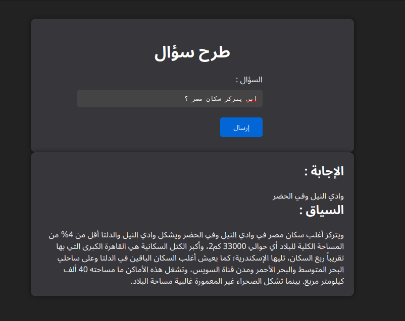
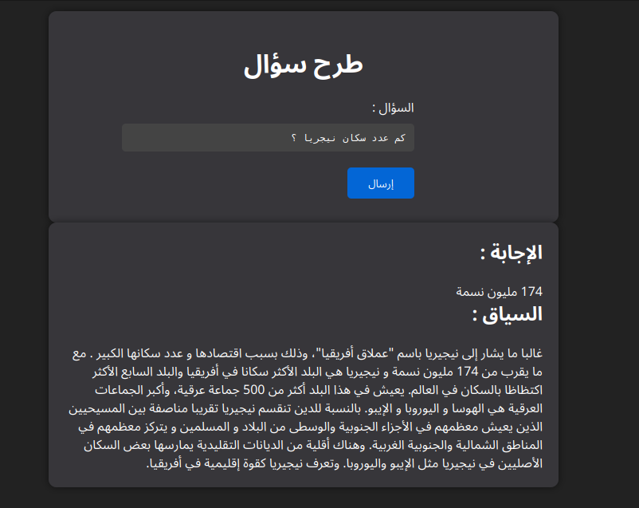

# Arabic Open Book QA

The **Arabic Open Book QA** is an advanced question-answering (QA) system aiming to enhance traditional QA approaches. In contrast to conventional methods directly matching context and questions for answers, our system integrates an information retrieval mechanism powered by the BM25 algorithm. This approach seeks to obtain context similar to the provided question, enabling answer extraction from the retrieved context using Transformers for Question Answering.

Unlike the traditional QA approach, where context and questions are matched for answers, the Question Answering models employed in our system can retrieve answers from a given text. This capability is particularly beneficial for efficiently searching for answers within documents.

## Screenshots
*Example 1: "Where is Egypt's population concentrated?" - The system answered in the Nile Valley and retrieved the context from the original data.*


*Example 2: "What is the population of Nigeria?" - Answer: 174M*


## Features
- Utilizes the BM25 algorithm for effective information retrieval.
- Implements Transformers for Question Answering techniques for answer extraction from the retrieved context.
- Provides an innovative alternative to conventional QA systems for improved accuracy.

## Getting Started
To begin with the Arabic Open Book QA, follow these steps:

### Prerequisites
Ensure you have the following prerequisites installed:
- Python (version 3.6 or higher)

### Installation
1. Clone the repository to your local machine:
   ```bash
   git clone https://github.com/your-username/arabic-open-book-qa.git
   cd arabic-open-book-qa

2. Update the data directory in the `app.py` code with your specific path.

3. Install the required dependencies:
    ```bash
    pip install -r requirements.txt
    ```

### Usage
Run the application using the following command:
```bash
python app.py
